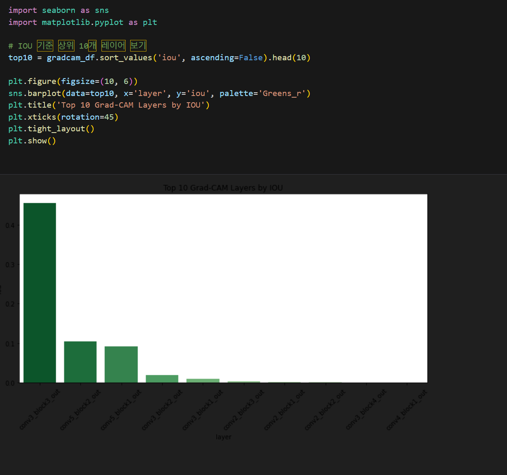
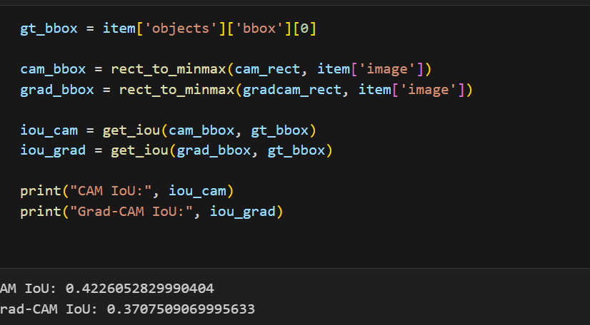
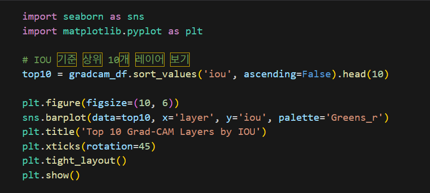
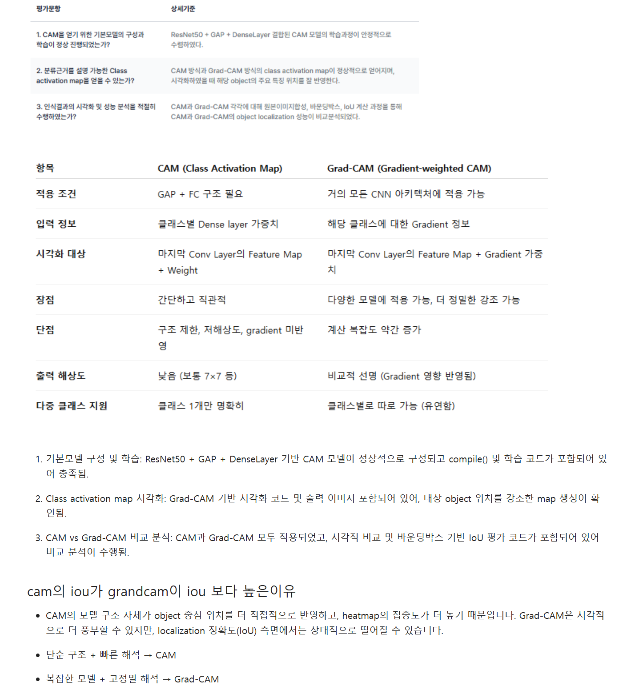
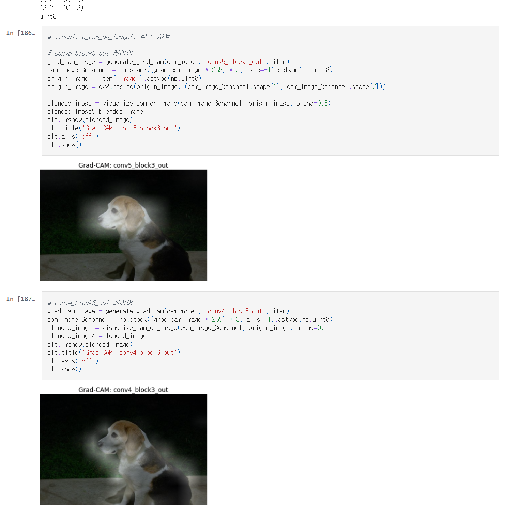

# AIFFEL Campus Online Code Peer Review Templete
- 코더 : 반태훈
- 리뷰어 : 김현진

# PRT(Peer Review Template)
- [x]  **1. 주어진 문제를 해결하는 완성된 코드가 제출되었나요?**
    - 문제에서 요구하는 최종 결과물이 첨부되었는지 확인
        - 중요! 해당 조건을 만족하는 부분을 캡쳐해 근거로 첨부
        
        cam모델과 grad-cam모델을 구현하고 iou로 서로 비교를 하였습니다.

- [x]  **2. 전체 코드에서 가장 핵심적이거나 가장 복잡하고 이해하기 어려운 부분에 작성된 
주석 또는 doc string을 보고 해당 코드가 잘 이해되었나요?**
    - 해당 코드 블럭을 왜 핵심적이라고 생각하는지 확인
    - 해당 코드 블럭에 doc string/annotation이 달려 있는지 확인
    - 해당 코드의 기능, 존재 이유, 작동 원리 등을 기술했는지 확인
    - 주석을 보고 코드 이해가 잘 되었는지 확인
        - 중요! 잘 작성되었다고 생각되는 부분을 캡쳐해 근거로 첨부

        
        여러 중요한 부분이 있겠지만 제일 핵심적인 cam과 grad-cam 모델을 iou로 비교하는 부분이 제일 핵심적이라 생각이 듭니다.
        
- [x]  **3. 에러가 난 부분을 디버깅하여 문제를 해결한 기록을 남겼거나
새로운 시도 또는 추가 실험을 수행해봤나요?**
    - 문제 원인 및 해결 과정을 잘 기록하였는지 확인
    - 프로젝트 평가 기준에 더해 추가적으로 수행한 나만의 시도, 
    실험이 기록되어 있는지 확인
        - 중요! 잘 작성되었다고 생각되는 부분을 캡쳐해 근거로 첨부
        
        grda-cam에서 상위10개 레이어를 직접 시각화하여 확인한 부분이 새로운 시도였습니다.
        추가적으로는 바운딩박스를 피사체에 맞게 조정하는 부분도 있었습니다.
        
- [x]  **4. 회고를 잘 작성했나요?**
    - 주어진 문제를 해결하는 완성된 코드 내지 프로젝트 결과물에 대해
    배운점과 아쉬운점, 느낀점 등이 기록되어 있는지 확인
    - 전체 코드 실행 플로우를 그래프로 그려서 이해를 돕고 있는지 확인
        - 중요! 잘 작성되었다고 생각되는 부분을 캡쳐해 근거로 첨부
        
        iou로 성능 평가를 하였을때 왜 그런 결과가 나온것인지 고민하고 결과를 도출하였습니다.
        
- [x]  **5. 코드가 간결하고 효율적인가요?**
    - 파이썬 스타일 가이드 (PEP8) 를 준수하였는지 확인
    - 코드 중복을 최소화하고 범용적으로 사용할 수 있도록 함수화/모듈화했는지 확인
        - 중요! 잘 작성되었다고 생각되는 부분을 캡쳐해 근거로 첨부
        
        lms코드를 사용하여 전체적으로 깔끔하게 진행되었습니다.3개의 cam이미지를 생성하여 확인하는 부분을 근거로 첨부하였습니다.


# 회고(참고 링크 및 코드 개선)
```
cam과 grad-cam 함수를 구현하고, 이미지를 생성하여 iou로 cam과 grad-cam의 성능을 비교하고, 왜 그런결과가 나온것인지까지 깔끔하게 진행되어 좋았습니다.
아쉬운 점은 직접구현보다는 lms코드를 사용한 점 외에는 없는 것 같습니다.구현부터,결과도출까지 깔끔하게 작성하셔서 좋았습니다.
```
